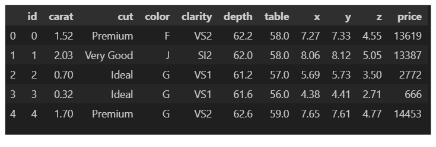
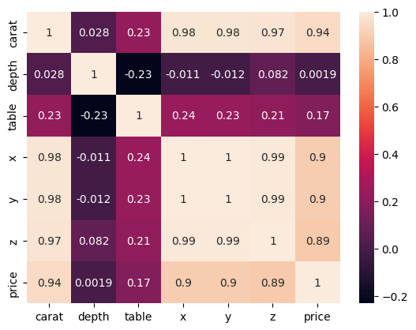
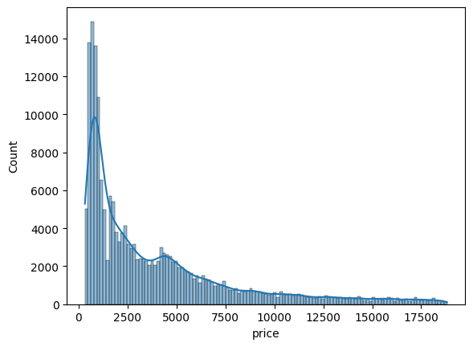
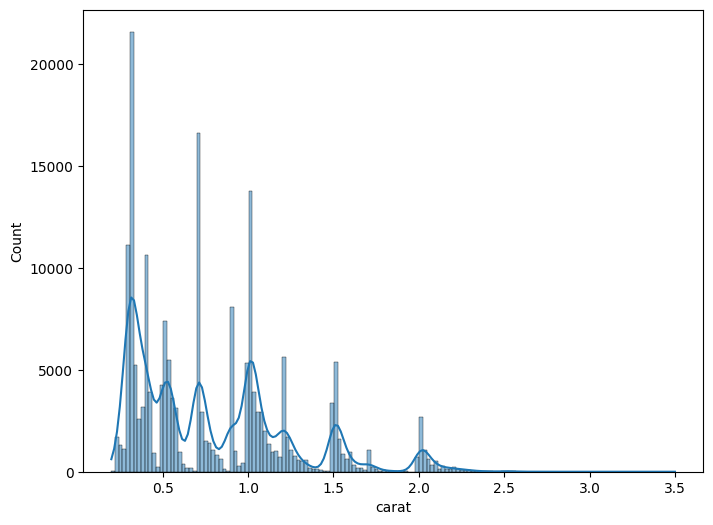
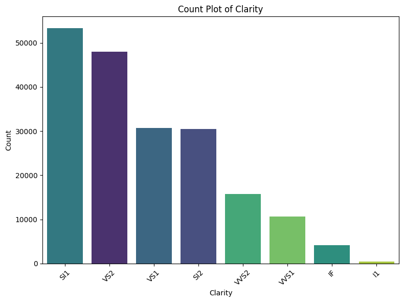
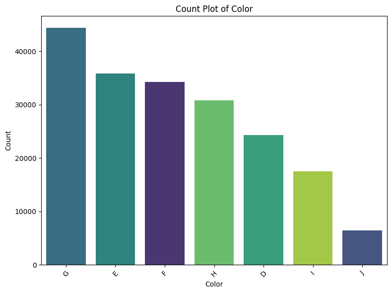
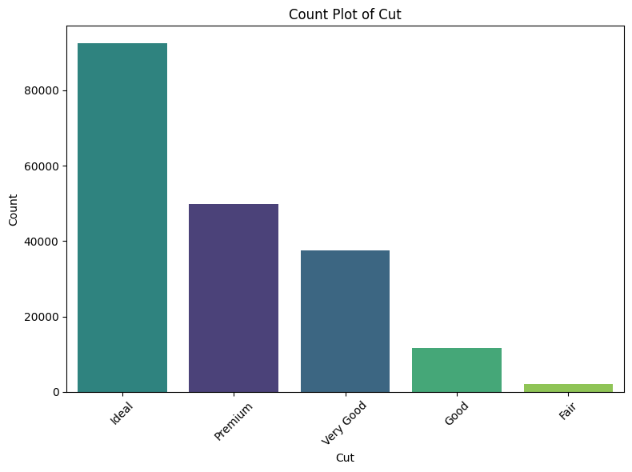
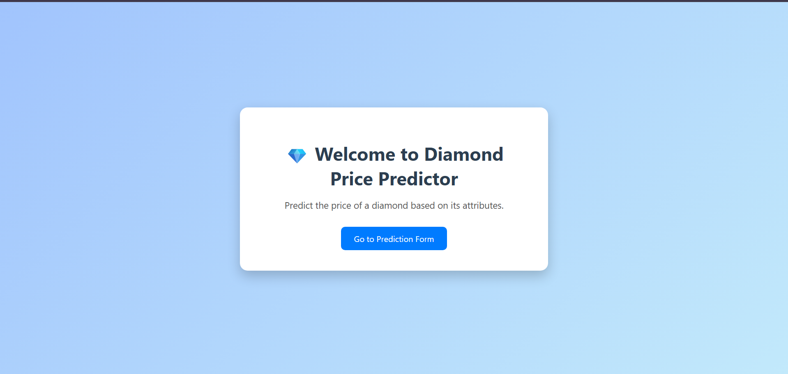
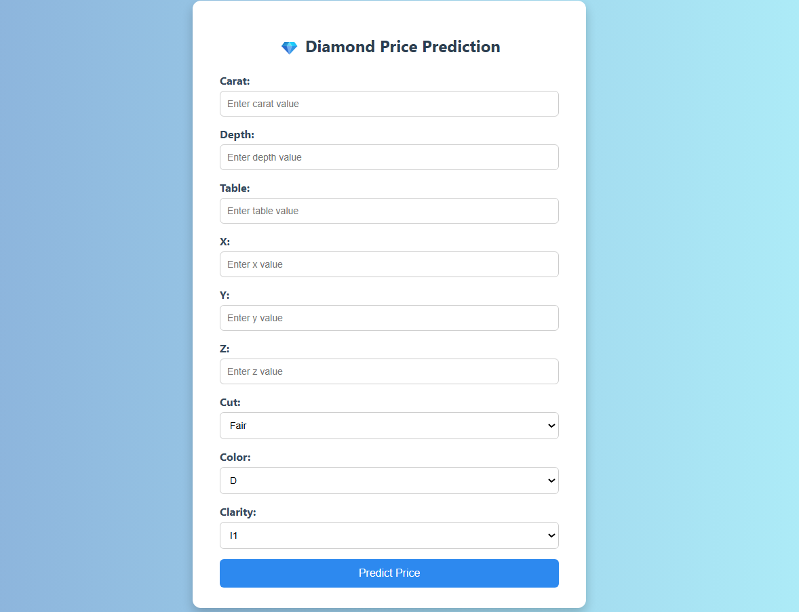
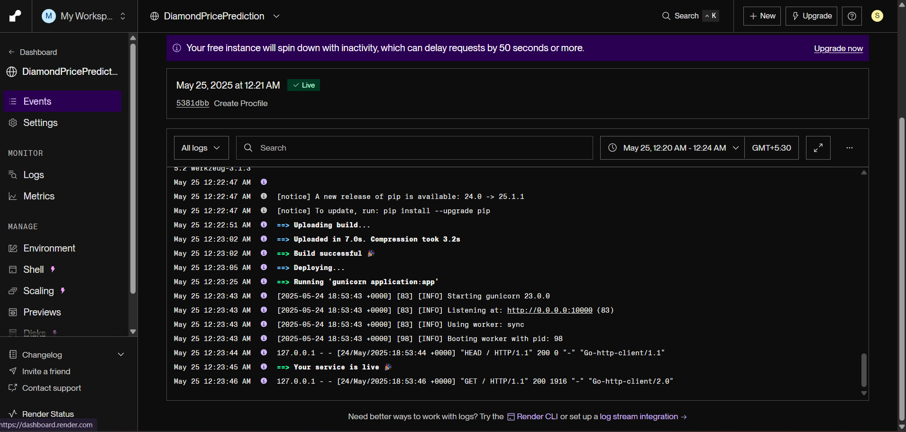

# 💎 Diamond Price Prediction using Machine Learning

A machine learning project to predict the price of diamonds based on their features using multiple regression models. The pipeline includes data ingestion, preprocessing, EDA, model training, evaluation, and a web-based deployment interface using Flask.

---

## 🧠 Problem Statement

The goal of this project is to develop a regression model that accurately predicts the price of diamonds based on attributes like carat, cut, color, clarity, dimensions, etc.

---

## 📊 Dataset Overview

The dataset `gemstone.csv` is used from the `notebooks/data/` folder. It contains features such as:

* `carat`, `cut`, `color`, `clarity`, `depth`, `table`, `x`, `y`, `z`, and `price`.

**The dataset** The goal is to predict `price` of given diamond (Regression Analysis).

There are 10 independent variables (including `id`):

* `id` : unique identifier of each diamond
* `carat` : Carat (ct.) refers to the unique unit of weight measurement used exclusively to weigh gemstones and diamonds.
* `cut` : Quality of Diamond Cut
* `color` : Color of Diamond
* `clarity` : Diamond clarity is a measure of the purity and rarity of the stone, graded by the visibility of these characteristics under 10-power magnification.
* `depth` : The depth of diamond is its height (in millimeters) measured from the culet (bottom tip) to the table (flat, top surface)
* `table` : A diamond's table is the facet which can be seen when the stone is viewed face up.
* `x` : Diamond X dimension
* `y` : Diamond Y dimension
* `x` : Diamond Z dimension

Target variable:
* `price`: Price of the given Diamond.

Dataset Source Link :
[https://www.kaggle.com/competitions/playground-series-s3e8/data?select=train.csv](https://www.kaggle.com/competitions/playground-series-s3e8/data?select=train.csv)

### 🖼️ Dataset Preview



---

## 📈 EDA & Insights

Exploratory Data Analysis was performed to identify patterns, outliers, and relationships.

### 🔍 Key Insights:

* `carat` and `x`, `y`, `z` dimensions show strong correlation with price.
* Categorical features like `cut`, `color`, and `clarity` impact price non-linearly.

### 📊 Correlation Heatmap  

*Visualizing the relationships between features.*
<div align="center">
    
</div>

---

### 💎 Carat vs Price  
*Shows the distribution of diamond weight (carat) and price.*

<div align="center">
  
  
</div>

---

### 🟨 Categorical Features Distribution

<div align="center">
  
  
  
</div>

## 🧰 Tech Stack

* Python
* Pandas, NumPy
* Scikit-learn
* Matplotlib, Seaborn
* Flask
* Gunicorn
* Render (Deployment)

---

## 🏗️ Project Structure


<details>
<summary>📁 <strong>Project Structure</strong> (click to expand)</summary>

```

Diamond_Price_Prediction
├── artifacts               # Contains model.pkl, preprocessor.pkl, train/test/raw\.csv
├── dpp_venv                # Virtual environment (not pushed to GitHub)
├── logs/                   # Logging outputs
├── notebooks               # EDA & training notebooks
│   ├── data
│   │   └── gemstone.csv
│   ├── EDA.ipynb
│   └── Model Training.ipynb
├── screen_shots            # Images used in README
├── src                     # Source code
│   ├── components          # Data ingestion, transformation, training
│   └── pipelines           # Training & prediction pipeline
├── templates              # HTML templates (form, index)
├── application.py          # Flask app entry point
├── Procfile                # Render deployment config
├── requirements.txt
├── setup.py
└── README.md

```
</details>


---

## 🧪 Model Training & Evaluation

### 🧠 Models Used:

* Linear Regression
* Lasso Regression
* Ridge Regression
* ElasticNet
* Decision Tree Regressor

### 📊 Model Comparison (R² Score)

```python
{
 'LinearRegression': 0.9363,
 'Lasso': 0.9363,
 'Ridge': 0.9363,
 'Elasticnet': 0.8545,
 'DecisionTree': 0.9556
}
```

### 🏆 Best Model: **Decision Tree Regressor**

---

## 📉 Final Model Metrics

| Model             | RMSE       | MAE        | R² Score   |
| ----------------- | ---------- | ---------- | ---------- |
| Linear Regression | 1013.90    | 674.03     | 93.69%     |
| Lasso Regression  | 1013.88    | 675.07     | 93.69%     |
| Ridge Regression  | 1013.91    | 674.06     | 93.69%     |
| ElasticNet        | 1533.42    | 1060.74    | 85.56%     |
| **Decision Tree** | **Best**   | **Best**   | **95.56%** |


---

## 🧪 Testing the Model

Use the web app or prediction pipeline to test manually:

Sample Input:

```
Carat: 0.7  
Depth: 61.5  
Table: 55  
x: 5.75  
y: 5.8  
z: 3.55  
Cut: Premium  
Color: G  
Clarity: VS2
```

💰 Predicted Price: \~ \$4321.0

---

# 🚀 Deployment


## 🌐 Live Demo link - 
[Diamond Price Predictor on Render](https://diamondpriceprediction-wdh4.onrender.com)

### 📁 Files for Deployment

* `application.py`: Flask entry point
* `templates/`: Contains form and index HTML files
* `model.pkl`, `preprocessor.pkl`: Trained model and scaler
* `Procfile`: Contains `web: gunicorn application:app`
* `requirements.txt`: All Python packages


## 🔧 Installation & Run Locally

### 📁 Step 1: Clone the Repository

 ```bash
git clone https://github.com/swarajRB/Diamond_Price_Prediction_ML_Project
cd Diamond_Price_Prediction_ML_Project
```

### 🐍 Step 2: Create a Virtual Environment

```bash
python -m venv dpp_venv
```

### ✅ Step 3: Activate the Virtual Environment

**For Windows:**

```bash
dpp_venv\Scripts\activate
```

**For Mac/Linux:**

```bash
source dpp_venv/bin/activate
```

### 📦 Step 4: Install the Dependencies

```bash
pip install -r requirements.txt
```

### 🧪 Step 5: Run the Training Pipeline

```bash
python src/pipelines/training_pipeline.py
```

### 🚀 Step 6: Run the Flask App Locally

```bash
python application.py
```
---
---

## 📸 Screenshots Summary


**🏠 Home Page**
*Landing page of the web application.*

<div align="center">
    
</div>

---
---

**📝 Prediction Form**
*User form for entering diamond features to get price prediction.*

<div align="center">
    
</div>

---
---

**📈 Prediction Result**
*Predicted diamond price displayed after form submission.*

<div align="center">
    
</div>

---
---

**✅ Render Deployment Logs**
*Successful deployment logs on Render.com*
<div align="center">
    
</div>

---
---


## Developed by -

**Swaraj Ranjan Behera**-
*Aspiring Data Analytics | ML & Data Science Enthusiast*


---
### 📬 **Contact**

If you have any questions or would like to collaborate, feel free to reach out to me:

- LinkedIn Profile - www.linkedin.com/in/swaraj-ranjan-behera-a26a17324

- Gmail : swarajranjan2003@gmail.com
---

Thank you for checking out the project! 😊

---

Feel free to adjust any sections to better fit your preferences. This `README.md` is designed to be both informative and easy to navigate for anyone who views your GitHub project.

### 📄 License

This project is licensed under the MIT License.
